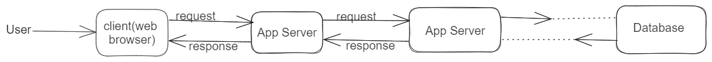
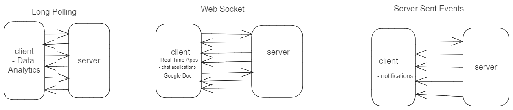
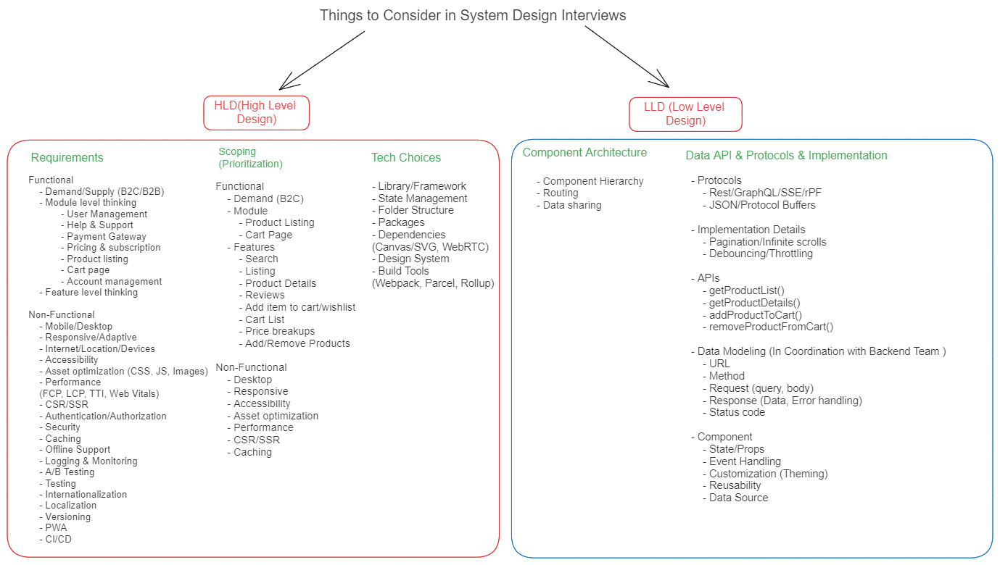

# System Design

# N-Tier Architecture

# Frontend System Design Components

- Architectural Patterns
  - Monolithic Frontend
  - Micro Frontend
- Communication Protocols
  - Long Polling
  - Web Socket
  - Server Sent Events
- Availability
  - Service Worker (offline support)
- Accessibility
  - Keyboard Accesibility
  - Screen reader
- Consistency
  - Polyfills, Browser specific CSS
  - Design System
- Credibility & Trust
  - SEO
- Logging & Monitoring
  - Error Logging
  - User tracking
  - User Activity
  - Feature Usage
  - Infra / Capacity monitoring
- Databases / Caching
  - HTTP Caching
  - In memory caching
  - Apollo graphql caching
  - State Management Libraries (Redux, Context API)
  - Local Storage
  - Session storage
  - Cookies
  - IndexedDB
- Security
  - DDOS attacks
  - Authentication & Authorization
  - CSP (Content Security Policy) - setting policies around who can access / inject certain things into our app
  - CORS
  - MITM (Man in the middle)
- Performance & Optimization
  - Assets optimization (images, js)
  - Delivery option (which type of communication to choose based on the business requirements)
  - Build Assets
  - SSR (Server Side Rendering)
  - Service worker
  - Web Vitals (metrics that we can rely on to see if our optimizations are working or do we need to change anything)
  - Perceived performance - making sure all the performance optimizations are user satisfactory
- Testing
  - Unit Testing - testing individual units like functions/methods
  - Integration Testing - testing combination of things like a complete feature/components
  - End-to-End Testing - testing the entire workflow
  - Some tools/libraries we use for testing
    - Jest, Mocha, Chai, Cypress, Selenium, Protractor, Playwright

# Micro-Frontends

- Different parts of a UI is Designed, Developed and Maintained by different teams
- We will able to use different technologies for different parts of the UI that serves the business purpose better (one app can be in React, another can be in Vue etc...)
- More Scalable
- Different ways to implement Micro-Frontends
  - Iframe
  - Web Components
  - Module Federation
  - MicroApps / Route based

# Communication Protocols

- Long Polling
  - Keep on asking the server until the entire data is received
  - Data analytics etc..
- Web Socket (Dual connection/ Bi-Directional)
  - Establish a persistent connection with the server and client receives the data as and when it is available
  - If we want any new data we send a new request and server sends the data till it finishes
  - Real time apps (Chat applications, google docs)
- Server Sent Events
  - Establish a connection with server and the application recieves the data as it is available we don't need to make any request to the server
  - Like Facebook notifications, friend requests, likes

# Consistency

- Browser specific CSS properties
- Polyfills - to make sure certain features work in different browsers
- Design System - to be consistent across all the applications
  - Material UI, ANT Design, Semantic UI

# Credibility & Trust

- On-Page
  - Our HTML Head tag should contain
    - title
    - description
    - meta
    - Content
  - Performance
- Off-Page
  - Backlinks - people reviewing and suggesting
  - Ads

# Databases/Caching

- HTTP Caching
  - caching the static assets like images, css, js
- In memory caching
- Apollo graphql caching
- State Management Libraries (Redux, Context API)
- Local Storage
- Session storage
- Cookies
- IndexedDB

# System-Design-Breakdown

